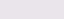
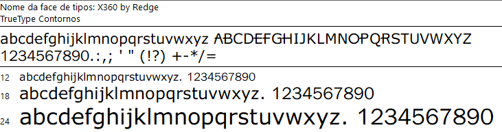

# Assets definidos para o projeto de Dashboard com Excel

## Paleta de Cores

| Nome da Cor | Finalidade       | Imagem da Cor                |
|-------------|------------------|------------------------------|
| \#9BC848    | Xbox Color       |  |
| \#22C55E    | Xbox Color       |  |
| \#2AE6B1    | Menus            |  |
| \#5BF6A8    | Menus            |  |
| \#E8E6E9    | negative zone    |  |

## Fontes True Types

Fonte X360 by Redge

Link para download

https://www.freefonts.io/download/xbox/

## Configuração células

| Elemento        | Tamanho | Código Cor |
|-----------------|---------|------------|
| Coluna A        | 30,57   | \#2AE6B1   |
| Colunas B,H,N,T | 3,00    |            |
| Linha 1         | 15,00   |            |
| Linha 2         | 39,00   |            |
| C2 (fonte)      |         | \#22C55E   |
| Linhas 3 a 6    | 8,25    |            |
| Linhas 7 a 30   | 15,00   |            |
| B7:T30          |         | \#E8E6E9   |

## Logos

 

## Ícones

 
 

[Retornar README](README.md)
