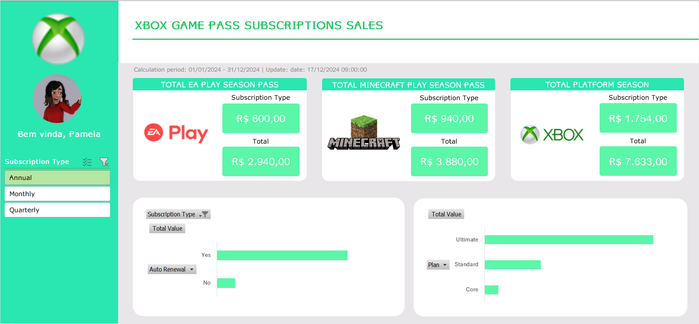

# Repositório de Dashboard com Excel - Assinaturas XBOX

  
  <h2 style="margin: 0;">Desafios do curso Heineken - Inteligência Artificial Aplicada a Dados com Copilot em parceria da DIO e Heineken.</h2>

 

## Ao longo do desenvolvimento do desafio foram realizado os seguintges ajustes

### Criação do diretório "assets" do repositório

#### O conteúdo da sheet Assets, foram salvas no diretório "assets" do repositório

> Para visualizar assets do projeto, clique aqui -> [Assets do Projeto](ASSETS.md)

 

### Simular conexão do arquivo Excel com banco de dados

#### Para simular a conexão do Excel a um banco de dados, o conteúdo da pasta "Bases" foi carregado em uma base SQLite

> Para mais informações de como conectar o Excel ao SQLite, clique aqui -> [Conectar Excel ao SQLite](CONEXAO_ODBC.md)

 

## Criando tabelas dinâmicas de calculos

### Perguntas de Negócios

1. Qual faturamento **EA Play Pass** detalhado por?
    1. Subscript Type
    2. Total

 

2. Qual faturamento **Minecraft Pass** detalhado por?
    1. Subscript Type
    2. Total

 

3. Qual faturamento **Total da Plataforma** detalhado por?
    1. Subscript Type
    2. Total

 

4. Qual faturamento **Total da Plataforma** segmetado Auto Renovação de Assinatura?

 

5. Qual faturamento **Total da Plataforma** segmetado Tipo de Plano?

 

## Dashboard Final

### Abaixo print de tela com a versão final do Dashboard criado

